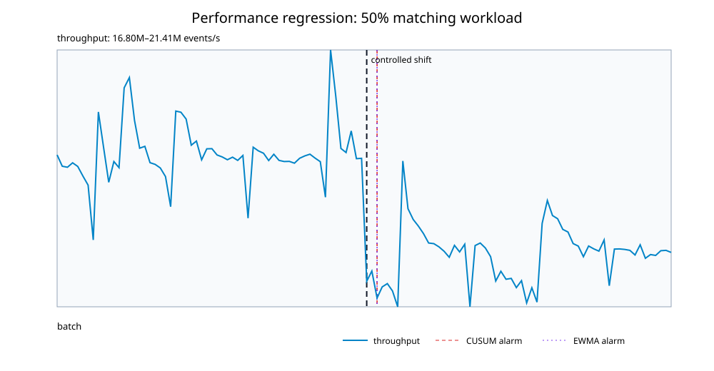

# C++ Limit Order Book and Matching Engine

A small, reproducible market-infrastructure project for learning how ordered market events update a limit order book. Version 0.5 adds batch telemetry and causal CUSUM/EWMA detection of controlled performance regressions.

This is an educational systems project—not a production exchange gateway, trading strategy, alpha model, or implementation of CME iLink.

## What the program does

1. Reads timestamped order events from CSV.
2. Maintains an ordered FIFO queue of individual orders at each bid and ask price level.
3. Uses an order-ID index with stored queue positions so cancellations do not require scanning the book.
4. Reports best bid, best ask, spread, rejected events, and replay throughput.
5. Tests ordering, cancellation, modification, partial/full execution, validation, and CSV parsing behavior.
6. Matches crossing limit orders at resting prices and emits auditable trade records.

Prices are stored as integer ticks: `10025` represents `$100.25` when one tick is one cent. Integer prices avoid floating-point equality and ordering problems.

## Architecture

```text
CSV events
    |
    v
CSV reader -> Event -> OrderBook -> top of book / validation result
                            |
                            v
                    matching engine
                     |          |
                     v          v
                trade records  benchmark
```

The book uses:

- `std::map<Price, PriceLevel>` for ordered bid and ask price levels;
- `std::list<OrderId>` for stable FIFO ordering within each price level;
- `std::unordered_map<OrderId, StoredOrder>` for average-case constant-time lookup and direct queue removal.

`std::map` prioritizes clarity and correctness. A production low-latency system would likely use specialized contiguous storage, custom allocators, and exchange-specific price bounds.

## Matching behavior

- A buy order matches while its limit price is greater than or equal to the best ask.
- A sell order matches while its limit price is less than or equal to the best bid.
- Better prices execute first; orders at the same price execute in FIFO order.
- Trades use the resting order's price.
- One incoming order may sweep multiple price levels.
- Any unfilled remainder becomes a resting order at the back of its price-level queue.

Each trade records a trade ID, incoming and resting order IDs, execution price, quantity, and timestamp.

## Build and test with CMake

Requires a C++17 compiler and CMake 3.16+.

```bash
cmake -S . -B build -DCMAKE_BUILD_TYPE=Release
cmake --build build
ctest --test-dir build --output-on-failure
./build/order_book_replay data/sample_events.csv
./build/order_book_benchmark 500000 lifecycle
./build/order_book_benchmark 500000 matching
./build/order_book_telemetry performance_telemetry.csv 120 20000 60 50
python3 analysis/performance_regression.py performance_telemetry.csv
```

## Build directly with Clang or GCC

```bash
mkdir -p build
c++ -std=c++17 -O2 -Wall -Wextra -Wpedantic -Iinclude \
  src/order_book.cpp src/csv_reader.cpp src/main.cpp \
  -o build/order_book_replay
c++ -std=c++17 -O2 -Wall -Wextra -Wpedantic -Iinclude \
  src/order_book.cpp src/csv_reader.cpp tests/order_book_tests.cpp \
  -o build/order_book_tests
c++ -std=c++17 -O2 -Wall -Wextra -Wpedantic -Iinclude \
  src/order_book.cpp benchmarks/replay_benchmark.cpp \
  -o build/order_book_benchmark
c++ -std=c++17 -O2 -Wall -Wextra -Wpedantic -Iinclude \
  src/order_book.cpp benchmarks/performance_telemetry.cpp \
  -o build/order_book_telemetry

./build/order_book_tests
./build/order_book_replay data/sample_events.csv
./build/order_book_benchmark 500000 lifecycle
./build/order_book_benchmark 500000 matching
./build/order_book_telemetry performance_telemetry.csv 120 20000 60 50
```

## CSV contract

```text
timestamp_ns,event_type,order_id,side,price_ticks,quantity
1000,ADD,1,BUY,10025,10
1010,ADD,2,SELL,10030,8
1020,MODIFY,1,BUY,10025,8
1030,EXECUTE,1,BUY,10025,3
1040,CANCEL,1,BUY,10025,5
```

For `CANCEL`, only `order_id` determines which stored order is removed. For `EXECUTE`, `order_id` and `quantity` are used. The remaining columns keep the schema uniform.

## Benchmark methodology

The benchmark supports two deterministic in-memory workloads:

- `lifecycle`: alternating ADD/CANCEL pairs across multiple price levels;
- `matching`: a resting sell followed by a crossing buy, producing one trade per pair.

It runs each workload twice on fresh books. The first pass measures batch throughput without a clock read around every event. The second, instrumented pass records per-event p50, p95, p99, and maximum latency. Keeping the passes separate prevents per-event timing overhead from contaminating the throughput number.

Build in Release mode before reporting results. Latencies include the overhead and resolution limits of `std::chrono::steady_clock`, so they are useful for controlled comparisons on the same machine—not claims about exchange-grade production latency. Numbers depend on hardware, compiler, optimization flags, workload, system load, and measurement scope.

The benchmark intentionally excludes event generation and CSV parsing from its timed passes to isolate order-book update and matching cost. The CLI measurement includes replay processing after parsing, but not file loading.

### Example v0.4 results

One local run on an Apple M4 MacBook Air with Apple Clang 17, Release `-O2`, and 1,000,000 events produced:

| Workload | Throughput | p50 | p95 | p99 | Max |
|---|---:|---:|---:|---:|---:|
| lifecycle | 22.66M events/s | 42 ns | 42 ns | 42 ns | 22,959 ns |
| matching | 19.92M events/s | 42 ns | 42 ns | 84 ns | 9,750 ns |

These are example measurements, not universal performance guarantees. The repeated 42 ns values reflect timer granularity as well as program work; maximum latency is especially sensitive to operating-system scheduling and background activity.

## Performance-regression experiment

The telemetry runner divides a deterministic event stream into time-ordered batches. The first half uses ADD/CANCEL lifecycle pairs. After a known change point, a configurable share of those pairs becomes a resting sell followed by a crossing buy, exercising the matching and trade-record path. Event generation and CSV parsing remain outside the timed region.

Each batch records throughput, p50/p95/p99/max latency, rejected events, active orders, and active price levels. Ten unrecorded lifecycle batches warm the relevant code paths before calibration begins.

```bash
./build/order_book_telemetry results/telemetry_25.csv 120 20000 60 25
./build/order_book_telemetry results/telemetry_50.csv 120 20000 60 50
./build/order_book_telemetry results/telemetry_100.csv 120 20000 60 100

python3 analysis/performance_regression.py \
  results/telemetry_25.csv results/telemetry_50.csv results/telemetry_100.csv \
  --output-dir results
```

The Python analysis calibrates both detectors from the first 30 baseline batches:

- lower-sided CUSUM accumulates standardized throughput drops and alarms when cumulative evidence exceeds a fixed threshold;
- lower-sided EWMA gives recent batches more weight and alarms when its smoothed value crosses a fixed control limit.

Neither detector reads the known change point or any future observation. The change point is used only after detection to count false alarms and calculate detection delay. The thresholds are intentionally conservative defaults for this controlled experiment, not universally tuned production settings.

This experiment asks whether a sustained execution-path shift can be detected above ordinary measurement noise. It does not diagnose the root cause, prove that matching is always slower, or represent production exchange traffic.

### Example v0.5 detection results

One local Apple M4 run with 120 batches, 20,000 events per batch, and a change at batch 60 produced:

| Post-change matching share | Mean throughput change | CUSUM false alarms / delay | EWMA false alarms / delay |
|---:|---:|---:|---:|
| 25% | +4.1% | 0 / not detected | 0 / not detected |
| 50% | -9.3% | 0 / 2 batches | 0 / 2 batches |
| 100% | -14.5% | 0 / 4 batches | 0 / 4 batches |



The 25% workload shift was not a measurable slowdown in this run, so neither detector raised an alarm. The non-monotonic detection delays and the apparent 25% speedup are evidence that a single process run is noisy; repeated runs and uncertainty estimates are required before drawing a general performance conclusion.

## Priority rules

- New orders join the back of their price level's FIFO queue.
- A quantity decrease at the same price preserves priority.
- A quantity increase or price change resets priority.
- A partial execution reduces remaining quantity without changing priority.
- A full execution removes the order and deletes an empty price level.

## Current limitations

- Only limit orders are matched; market orders and time-in-force instructions are not implemented.
- Replay `MODIFY` events update resting state but do not yet emit trades when a modification becomes marketable.
- No fees, exchange-specific protocol rules, persistence, networking, or strategy logic.
- Events are processed on one thread to preserve deterministic order.
- The synthetic benchmark is not representative of CME traffic.
- This code has not been connected to CME iLink, exchange multicast feeds, FPGA hardware, or colocation infrastructure.

## Next engineering experiments

1. Repeat each regression scenario across processes and report uncertainty across runs.
2. Use a system profiler to identify allocation and container hot spots after an alarm.
3. Compare the FIFO implementation with more cache-friendly storage and retain changes only when benchmarks improve.
4. Add market-order and time-in-force semantics such as IOC.
5. Test networked replay while separating transport, parsing, and book-processing cost.
