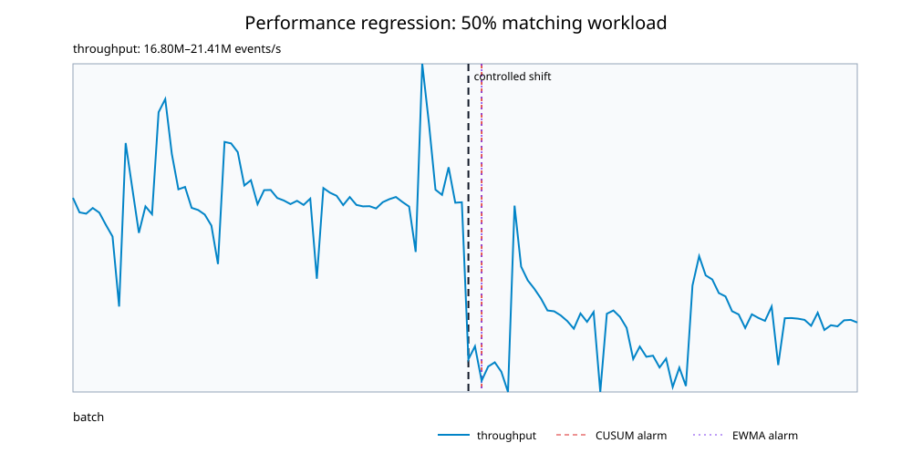

# C++ Limit Order Book and Matching Engine

A small, reproducible market-infrastructure project for learning how ordered market events update a limit order book. Version 0.8 adds **differential testing**: every randomized event stream is run through the real `OrderBook` and a deliberately naive reference implementation, and every observable output—result code, each trade field, resting quantity, and full FIFO depth—must match after every event. See [Differential testing](#differential-testing-v08). Version 0.7 introduced the unified engine contract and fixed marketable-`MODIFY` and strict CSV parsing bugs; see [v0.7 correctness fixes](#v07-correctness-fixes).

This is an educational systems project—not a production exchange gateway, trading strategy, alpha model, or implementation of CME iLink.

## What the program does

1. Reads timestamped order events from CSV.
2. Maintains an ordered FIFO queue of individual orders at each bid and ask price level.
3. Uses an order-ID index with stored queue positions so cancellations do not require scanning the book.
4. Reports best bid, best ask, spread, rejected events, and replay throughput.
5. Tests ordering, cancellation, modification, partial/full execution, validation, and CSV parsing behavior.
6. Matches crossing limit orders at resting prices and emits auditable trade records.

Prices are stored as integer ticks: `10025` represents `$100.25` when one tick is one cent. Integer prices avoid floating-point equality and ordering problems.

## Architecture

```text
CSV events
    |
    v
CSV reader -> Event -> OrderBook -> EngineResult / top of book
                            |
                            v
                    matching engine
                     |          |
                     v          v
                trade records  benchmark
```

The book uses:

- `std::map<Price, PriceLevel>` for ordered bid and ask price levels;
- `std::list<OrderId>` for stable FIFO ordering within each price level;
- `std::unordered_map<OrderId, StoredOrder>` for average-case constant-time lookup and direct queue removal.

`std::map` prioritizes clarity and correctness. A production low-latency system would likely use specialized contiguous storage, custom allocators, and exchange-specific price bounds.

## Matching behavior

- A buy order matches while its limit price is greater than or equal to the best ask.
- A sell order matches while its limit price is less than or equal to the best bid.
- Better prices execute first; orders at the same price execute in FIFO order.
- Trades use the resting order's price.
- One incoming order may sweep multiple price levels.
- Any unfilled remainder becomes a resting order at the back of its price-level queue.

Each trade records a trade ID, incoming and resting order IDs, execution price, quantity, and timestamp.

## Stable engine contract (v0.7)

All commands use `process(Event)` and return `EngineResult`: acceptance, a stable
`ResultCode`, remaining quantity, zero or more ordered trades, and echoed symbol /
request sequence. Marketable modifications now match immediately at resting prices;
same-price quantity reductions and unchanged quantities preserve FIFO priority.

See [the engine contract](docs/engine-contract.md) for the input/output tables,
validation order, state transitions, ID/sequence semantics and failure model.
`ProcessResult` and `SubmitResult` have been replaced by `EngineResult`; the public
resting-only `add` helper has been removed in favor of `submit` or `process(Add)`.

```cpp
lob::OrderBook book(1);
const auto result = book.process({1000, lob::EventType::Add,
    {42, lob::Side::Buy, 10025, 10}, 1, 7});
// result.symbol_id == 1, result.sequence == 7
// Inspect result.code and result.trades; do not parse result.message.
```

## Build and test with CMake

Requires a C++17 compiler and CMake 3.16+. Without CMake, use `make -j4 all test`
(the test target also requires Python 3), or the direct compiler commands below.

```bash
cmake -S . -B build -DCMAKE_BUILD_TYPE=Release
cmake --build build
ctest --test-dir build --output-on-failure
./build/order_book_replay data/sample_events.csv
./build/order_book_replay data/marketable_modify.csv
./build/order_book_benchmark 500000 lifecycle
./build/order_book_benchmark 500000 matching
./build/order_book_telemetry performance_telemetry.csv 120 20000 60 50
./build/order_book_property_fuzz 1 10000 fuzz_failure.txt
./build/order_book_differential 1 20000 differential_failure.csv
./build/order_book_differential --replay tests/corpus/v0_6_marketable_modify.csv
python3 analysis/performance_regression.py performance_telemetry.csv
python3 analysis/mutation_experiment.py
```

## Build directly with Clang or GCC

```bash
mkdir -p build
c++ -std=c++17 -O2 -Wall -Wextra -Wpedantic -Iinclude \
  src/order_book.cpp src/csv_reader.cpp src/main.cpp \
  -o build/order_book_replay
c++ -std=c++17 -O2 -Wall -Wextra -Wpedantic -Iinclude \
  src/order_book.cpp src/csv_reader.cpp tests/order_book_tests.cpp \
  -o build/order_book_tests
c++ -std=c++17 -O2 -Wall -Wextra -Wpedantic -Iinclude \
  src/order_book.cpp src/csv_reader.cpp tests/engine_contract_tests.cpp \
  -o build/engine_contract_tests
c++ -std=c++17 -O2 -Wall -Wextra -Wpedantic -Iinclude \
  src/order_book.cpp benchmarks/replay_benchmark.cpp \
  -o build/order_book_benchmark
c++ -std=c++17 -O2 -Wall -Wextra -Wpedantic -Iinclude \
  src/order_book.cpp benchmarks/performance_telemetry.cpp \
  -o build/order_book_telemetry
c++ -std=c++17 -O2 -Wall -Wextra -Wpedantic -Iinclude \
  src/order_book.cpp tests/order_book_property_fuzz.cpp \
  -o build/order_book_property_fuzz

./build/order_book_tests
./build/engine_contract_tests
./build/order_book_replay data/sample_events.csv
./build/order_book_replay data/marketable_modify.csv
./build/order_book_benchmark 500000 lifecycle
./build/order_book_benchmark 500000 matching
./build/order_book_telemetry performance_telemetry.csv 120 20000 60 50
```

## CSV contract

```text
timestamp_ns,event_type,order_id,side,price_ticks,quantity
1000,ADD,1,BUY,10025,10
1010,ADD,2,SELL,10030,8
1020,MODIFY,1,BUY,10025,8
1030,EXECUTE,1,BUY,10025,3
1040,CANCEL,1,BUY,10025,5
```

The legacy six-column schema uses symbol 1 and assigns request sequences 1, 2, ...
in data-row order. An optional eight-column schema appends `symbol_id,sequence`;
see [the marketable-modify example](data/marketable_modify.csv). The CLI runs symbol 1.
A file must use one consistent schema; headers, when supplied, must match exactly.
CRLF is supported. Numeric fields must be complete decimal integers in range;
unsigned fields reject negative values, and extra columns, empty numbers, whitespace
and numeric suffixes are rejected with a line number. Quoted CSV fields are unsupported.
Zero quantity / nonpositive price are parsed when representable and rejected by the
engine where that command requires positive values.

For `CANCEL`, only `order_id` determines which stored order is removed. For `EXECUTE`, `order_id` and `quantity` are used. The remaining columns keep the schema uniform.

## Engine benchmark (deep book, mixed workload)

```bash
scripts/run_engine_benchmark.sh   # Release build, ~30 s, writes docs/benchmarks/<date>-<os>-<arch>.md
```

The benchmark pre-fills 5,000 orders per side over 500 levels, then replays
1,000,000 requests. The mix is passive adds, cancels, modifies and aggressive
orders that sweep one or more levels, with about 176k trades. It reports:

- median, min and max throughput across 7 runs;
- p50, p90, p99 and p99.9 latency for each operation type;
- the machine, compiler and commit that produced the numbers.

Method, caveats and recorded runs are in
[docs/benchmarks/](docs/benchmarks/README.md). Quote numbers from there, not from
the older benchmark below, which measures a nearly empty book.

## Benchmark methodology

The benchmark supports two deterministic in-memory workloads:

- `lifecycle`: alternating ADD/CANCEL pairs across multiple price levels;
- `matching`: a resting sell followed by a crossing buy, producing one trade per pair.

It runs each workload twice on fresh books. The first pass measures batch throughput without a clock read around every event. The second, instrumented pass records per-event p50, p95, p99, and maximum latency. Keeping the passes separate prevents per-event timing overhead from contaminating the throughput number.

Build in Release mode before reporting results. Latencies include the overhead and resolution limits of `std::chrono::steady_clock`, so they are useful for controlled comparisons on the same machine—not claims about exchange-grade production latency. Numbers depend on hardware, compiler, optimization flags, workload, system load, and measurement scope.

Both current workloads return the book to empty after each pair, with at most one
resting order. They measure minimal operation paths, not populated-book depth,
long FIFO queues or realistic multi-order sweeps. Historical v0.4/v0.5 figures below
have not been rerun for the v0.7 result contract and must not be treated as v0.7 results.

The benchmark intentionally excludes event generation and CSV parsing from its timed passes to isolate order-book update and matching cost. The CLI measurement includes replay processing after parsing, but not file loading.

### Example v0.4 results

One local run on an Apple M4 MacBook Air with Apple Clang 17, Release `-O2`, and 1,000,000 events produced:

| Workload | Throughput | p50 | p95 | p99 | Max |
|---|---:|---:|---:|---:|---:|
| lifecycle | 22.66M events/s | 42 ns | 42 ns | 42 ns | 22,959 ns |
| matching | 19.92M events/s | 42 ns | 42 ns | 84 ns | 9,750 ns |

These are example measurements, not universal performance guarantees. The repeated 42 ns values reflect timer granularity as well as program work; maximum latency is especially sensitive to operating-system scheduling and background activity.

## Performance-regression experiment

The telemetry runner divides a deterministic event stream into time-ordered batches. The first half uses ADD/CANCEL lifecycle pairs. After a known change point, a configurable share of those pairs becomes a resting sell followed by a crossing buy, exercising the matching and trade-record path. Event generation and CSV parsing remain outside the timed region.

Each batch records throughput, p50/p95/p99/max latency, rejected events, active orders, and active price levels. Ten unrecorded lifecycle batches warm the relevant code paths before calibration begins.

```bash
./build/order_book_telemetry results/telemetry_25.csv 120 20000 60 25
./build/order_book_telemetry results/telemetry_50.csv 120 20000 60 50
./build/order_book_telemetry results/telemetry_100.csv 120 20000 60 100

python3 analysis/performance_regression.py \
  results/telemetry_25.csv results/telemetry_50.csv results/telemetry_100.csv \
  --output-dir results
```

The Python analysis calibrates both detectors from the first 30 baseline batches:

- lower-sided CUSUM accumulates standardized throughput drops and alarms when cumulative evidence exceeds a fixed threshold;
- lower-sided EWMA gives recent batches more weight and alarms when its smoothed value crosses a fixed control limit.

Neither detector reads the known change point or any future observation. The change point is used only after detection to count false alarms and calculate detection delay. The thresholds are intentionally conservative defaults for this controlled experiment, not universally tuned production settings.

This experiment asks whether a sustained execution-path shift can be detected above ordinary measurement noise. It does not diagnose the root cause, prove that matching is always slower, or represent production exchange traffic.

### Example v0.5 detection results

One local Apple M4 run with 120 batches, 20,000 events per batch, and a change at batch 60 produced:

| Post-change matching share | Mean throughput change | CUSUM false alarms / delay | EWMA false alarms / delay |
|---:|---:|---:|---:|
| 25% | +4.1% | 0 / not detected | 0 / not detected |
| 50% | -9.3% | 0 / 2 batches | 0 / 2 batches |
| 100% | -14.5% | 0 / 4 batches | 0 / 4 batches |



The 25% workload shift was not a measurable slowdown in this run, so neither detector raised an alarm. The non-monotonic detection delays and the apparent 25% speedup are evidence that a single process run is noisy; repeated runs and uncertainty estimates are required before drawing a general performance conclusion.

## Property-based testing and fuzzing

**Research question:** can stateful invariant checking detect interaction bugs that the existing example-based unit tests miss?

The stateful property fuzzer generates reproducible sequences of submit, cancel,
modify and execute operations from a fixed seed, including crossing replacements and
rejected commands. Every operation is submitted through `process` and compared with
an independent reference book implemented as an arrival-ordered vector with linear
scans. Comparisons cover every trade and the complete live-order/FIFO state. It also
audits properties broader than individual examples:

- every indexed order appears exactly once in a FIFO queue;
- each stored iterator, side, and price agrees with its price level;
- each level's aggregate quantity equals the sum of its resting orders;
- empty levels and zero-quantity resting orders cannot remain;
- automatic matching cannot leave a crossed resting book;
- submitted quantity equals traded quantity plus resting quantity;
- every trade respects best-price and FIFO priority, quantity and resting price;
- same-price quantity reductions preserve priority, while increases or price changes move an order to the FIFO back.

```bash
./build/order_book_property_fuzz 1 10000 fuzz_failure.txt
./build/order_book_property_fuzz 42 10000 fuzz_failure.txt
```

The seed makes a generated run reproducible. If a property fails, the runner removes chunks of operations while preserving the failure category and writes the reduced sequence, seed, failing step, and reason to the requested file. This is deterministic differential random testing rather than coverage-guided fuzzing such as libFuzzer or AFL++.

## Differential testing (v0.8)

**Question:** does the optimized book produce exactly the same observable behaviour as an implementation simple enough to verify by reading?

`tests/differential_reference_book.hpp` keeps every resting order in one flat vector with an insertion sequence number. Price-time priority is literally "best price, then smallest sequence number", found by linear scan; modification is "shrink in place if same price and not larger, otherwise remove and resubmit". It shares data types with `OrderBook` but none of its logic (no `map`, `list`, iterators, or per-level totals).

`tests/order_book_differential.cpp` drives both books with the same event stream and compares, after **every** event:

- `accepted` and `resting_quantity`;
- every trade: ID, aggressor, resting order, price, quantity, timestamp;
- both sides' full depth: level prices, level totals, and every order's ID and quantity in FIFO order;
- order count, plus `OrderBook::validate_invariants()`.

The generator tracks state with the **reference** book, so the implementation under test no longer decides which events get generated (in the property fuzzer, the generator's model is `OrderBook` itself). About 20% of generated events are deliberately invalid—duplicate IDs, zero quantities, non-positive prices, unknown IDs, over-executions—so rejection paths are compared too. A narrow 21-tick price band keeps the book crossing often. A passing run prints what it exercised, for example:

```text
differential_passed seed=7 steps=20000
  ADD=8238/757(ok/rej) CANCEL=2732/571(ok/rej) MODIFY=3926/586(ok/rej) EXECUTE=2356/834(ok/rej)
  trades=5020 multi_trade_events=1189 crossing_modifies=474 max_resting_orders=26
```

On a mismatch the stream is minimized and saved as a replay CSV that `--replay` and `order_book_replay` both accept. Saved reproducers go in `tests/corpus/`, and CMake registers every file there as a test, so a fixed bug stays fixed.

**What it found on its first run.** v0.7 made `process()` return `resting_quantity` for `EXECUTE`, but it returned the order's remaining quantity even when the execution was *rejected*; every other rejected operation returns 0. Minimized reproducer (`tests/corpus/v0_7_rejected_execute_resting_qty.csv`):

```text
1,ADD,2157,SELL,9991,24
2,EXECUTE,2157,SELL,9991,28     # rejected over-execution: reported 24, reference 0
```

No existing test inspected that field on a rejected execution. It is minor, but it was a real API inconsistency, and it was found in the first seconds of the first run.

Verification for this release: 200 release seeds × 20,000 events and 30 ASan/UBSan seeds × 5,000 events with no mismatches, plus the corpus replayed under sanitizers.

**Limits.** Agreement with the reference is only evidence of correctness if the reference is right; it is kept small enough to review line by line, and `OrderBook` is independently checked by the unit tests and invariants, so a shared mistake would have to slip past all three. The generator keeps books shallow (tens of orders) to force frequent crossing; it does not test deep-book or large-ID behaviour.

### Mutation experiment

`analysis/mutation_experiment.py` creates temporary source copies, injects one controlled fault at a time, and runs the unit suite plus five fixed seeds each of the property fuzzer and the differential fuzzer. Mutated source files are deleted with the temporary directory and never replace production code.

| Controlled mutant | Unit tests | Property fuzzer | Differential |
|---|---|---|---|
| Skip level-total update during execution | Killed | Killed | Killed |
| Skip level-total update during cancellation | Killed | Killed | Killed |
| Reset FIFO priority for an equal-quantity modification | Killed | Killed | Killed |
| Require strict inequality for a crossing buy | Killed | Killed | Killed |
| Require strict inequality for a crossing sell | Killed | Killed | Killed |
| Marketable modify rests without matching (the v0.6 bug) | Killed | Killed | Killed |
| Trade printed at the incoming price, not the resting price | Killed | Killed | Killed |
| Trade ID never increments | Killed | Killed | Killed |
| Trade timestamp dropped | Killed | Killed | Killed |
| Quantity increase keeps FIFO priority | Killed | **Survived** | Killed |
| **Total killed** | 10/10 | 9/10 | 10/10 |

Read this carefully: the mutants are few and hand-written, so the totals are not a general detection-rate estimate. The current unit suite and differential harness killed all ten selected mutants. The property fuzzer missed the deliberately injected FIFO-priority bug for quantity increases under these five seeds, while the differential comparison caught it. The useful conclusion is structural: each method exercises a different oracle, and agreement across example tests, properties, invariants, and a reference implementation is stronger evidence than any one method alone.

## v0.7 correctness fixes

Two bugs were confirmed in v0.6 and are now covered by regression tests in `tests/order_book_tests.cpp`.

**1. A marketable `MODIFY` left a crossed book.** With `BUY 1 @ 100` and `SELL 2 @ 105` resting, `MODIFY 1 -> BUY @ 110` rested the bid above the ask (spread `-0.05`) with no trade, and `validate_invariants()` reported `crossed resting book`. The fix routes every priority-resetting modification through `submit()`, so it matches exactly like a new order before any remainder rests. `modify()` and `process()` return `EngineResult`, which carries stable result codes and trades.

**2. Negative CSV quantities were accepted.** `std::stoull("-5")` returns `2^64 - 5`, so a row with quantity `-5` created an order for 18,446,744,073,709,551,611 shares. The reader now uses `std::from_chars`, requires the whole field to be consumed, and reports overflow.

**Why the fuzzer missed bug 1.** The v0.6 generator clamped modify prices to the passive side of the spread (`min(price, best_ask - 1)` for bids), so the crossing path was never exercised. v0.7 draws modify prices from the full band and adds modify-specific properties: quantity conservation, the modified order as aggressor, "a marketable modify must trade", and "a fully filled modify leaves no order". Reintroducing the bug as a mutant shows the difference:

| Fuzzer | Seeds 1, 7, 42, 2026, 20260831 × 5,000 steps |
|---|---|
| v0.6 (clamped) | all pass — bug not detected |
| v0.7 (full band) | fails at step 28 of seed 1; minimized to 3 operations |

```text
# reason=marketable modify did not trade
SUBMIT,2299,BUY,10009,91
SUBMIT,2302,SELL,10020,25
MODIFY,2302,SELL,10005,64
```

The lesson is that a random-testing harness is only as good as its input distribution: a constraint added to keep generated states "valid" silently removed the interesting ones.

Verification for v0.7 included unit and property tests under ASan/UBSan, fixed-seed release runs, and the mutation experiment.

## Priority rules

- New orders join the back of their price level's FIFO queue.
- A quantity decrease at the same price preserves priority.
- A quantity increase or price change resets priority and matches immediately if the replacement is marketable.
- A partial execution reduces remaining quantity without changing priority.
- A full execution removes the order and deletes an empty price level.

## Current limitations

- Only limit orders are matched; market orders and time-in-force instructions are not implemented.
- One configured symbol per book; no session sequencing, deduplication or client report routing.
- `EXECUTE` is an external replay adjustment and does not synthesize counterparty trades.
- No fees, exchange-specific protocol rules, persistence, networking, or strategy logic.
- Events are processed on one thread to preserve deterministic order.
- The synthetic benchmark is not representative of CME traffic.
- This code has not been connected to CME iLink, exchange multicast feeds, FPGA hardware, or colocation infrastructure.

## Next engineering experiments

1. ~~**v0.8 — differential testing.**~~ Done; see [Differential testing](#differential-testing-v08).
2. **v0.9 — event log, snapshots, deterministic replay.** Sequenced input/output log; periodic snapshots; recovery from snapshot + log tail must reproduce the same state hash and trade stream as a full replay.
3. **v1.0 — networked replay and profiling.** Add a length-prefixed TCP replay service, separate transport/parsing/matching costs, then make one profiling-driven optimization guarded by the differential tests.
